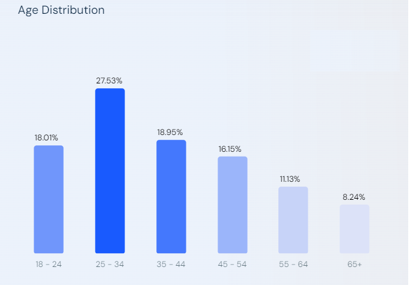

# Проектирование платформы "Букмейт" - сервиса для чтения и прослушивания книг

## Содержание

- ### [Тема и целевая аудитория](#1_part)
- ### [Расчет нагрузки](#2_part)
- ### [Источники](#sources)

## 1. Тема и целевая аудитория 

- Область присутствия - Россия
- Аналитика по возрастным группам

- Распределение пользователей по полу:
    - Женщины - 49.91%
    - Мужчины - 50.09%

### Функционал

- Регистрация
- Чтение книг/комиксов
- Прослушивание аудиокниг
- Полки
- Отзывы на книги/аудиокниги/комиксы
- Поиск

## 2. Расчет нагрузки 

### Продуктовые метрики

- [Согласно представленной информации](https://www.similarweb.com/website/bookmate.ru/#demographics), значение ***MAO*** составляет ***4.3 млн. пользователей***
- По размеру дневной аудитории не удалось найти информацию в открытых источниках, потому определим показатель ***DAO***, исходя из приблизительных вычислений:
    - Т.к. небольшой процент людей читает на каждодневной основе, возьмем приближенный коэффициент ***~0.3*** от числа уникальных пользователей в месяц, получаем
      
    > 0.3*4.3 = 1.29 млн. пользователей в сутки

- Предположим, что 50% ежедневных пользователей читают книги, 40% - слушают аудиокниги, 10% - читают комиксы
- Интенсивность использования разных функций:
    1. Чтение книг:
        - Опорная метрика - ***среднее количество страниц, читаемых пользователем в день***. По причине отсутствия этой и подобных метрик примем значение с некоторой погрешностью: ***3.8 страниц в день***
    2. Прослушивание аудиокниг:
        - Примем следующее значение: ***1.2 мин. в день***
    3. Просмотр комиксов:
        - Примем следующее значение: ***0.001 страницы в день***
    4. Написание отзывов:
        - Примем следующее значение: ***0.0002 отзыва в день***
    5. Использование поиска:
        - Примем следующее значение: ***0.8 запроса в день***

| Действие | Ср. значение метрики |
| --- | --- |
| Чтение страниц | 3.8 [шт.] |
| Прослушивание аудиокниги | 1.2 [мин.] |
| Чтение комиксов | 0.001 [шт.] |
| Написание отзыва | 0.0002 [шт.] |
| Поисковый запрос | 0.8 [шт.] |
- Объем данных пользователя:
    - ***Данные аккаунта*** - ~25Кб (размер аватарки с учетом сжатия - ~20Кб, размер прочих текстовых данных - ~5 Кб)

## Источники: 

1. [bookmate.ru Traffic Analytics, Ranking Stats & Tech Stack | Similarweb](https://www.similarweb.com/website/bookmate.ru/#demographics)
